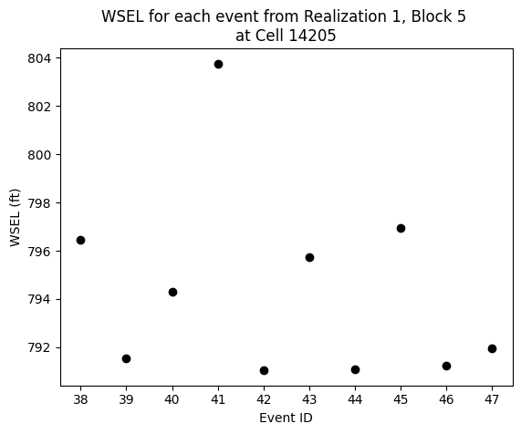
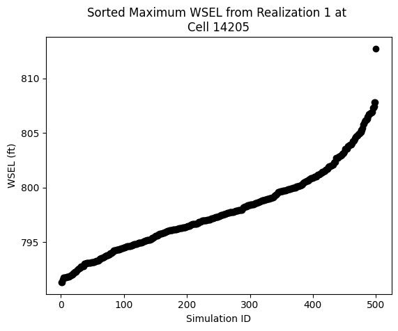
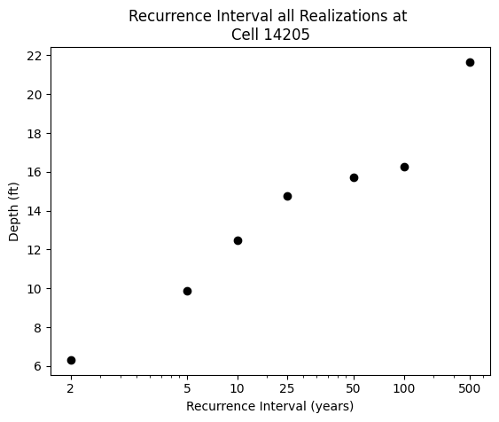
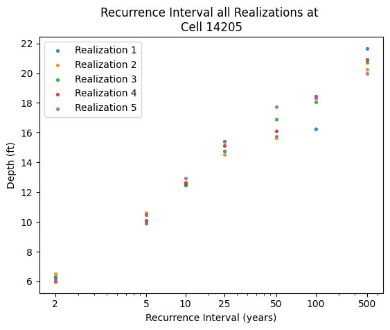

## multi-ras-to-aep-mapper

### Summary
Scripts for generating frequency grids from multiple HEC-RAS simulations.

#### Scripts

- get_file_list.py - Searches for S3 objects with a given prefix in a specified bucket and adds them as a list to a text file. For monte carlo analyses, there
may be many millions of files. This script should be run one time and the output used for downstream processing.

- compile_plan_data.py - Compiles water surface elevation data from plan files located on s3. It reads the list of plan file keys
generated from get_file_list.py, divides them into batches, processes each batch, and concatenates the results into a single summary
dataframe which is then saved to a parquet file.

- get_block_max_data.py - Processes water surface elevation data to find the highest values from each block and corresponding events
for each cell. Uses dask dataframe for efficiency, reads data from parquet file generated from compile_plan_data.py, gets block and event data
from the provided blockfile, and outputs the results into parquet files.

- example_plots.py - Creates example plots from the data provided from the scripts.

- utils.py - Contains mostly plotting functions.

### Setup

First, create a .env based on the the example.env with access and secret access keys. This is only needed for only step 1 (get_file_list.py).

#### Steps:

1. Input the desired bucket_name and output_file name in get_file_list.py, altering the prefix and/or suffix in the search_s3_objects function if needed. Run the get_file_list.py script.
2. In compile_plan_data, set plan_files_txt_file to the txt file generated by step 1 which contains the desired ras plan s3 keys and set the bucket_name where to the bucket where the files are located. Update output_pq_name which is the name of the output parquet file. Run compile_plan_data.py.
3. In get_block_max_data.py, set the cells_pq to the output of step 2 and set the blockfile varibale to the location of the block metadata. Set the desired realization and output prefix and then run get_block_max_data.py.

### Workflow with Example Plots

- Once steps 1 & 2 are complete, a parquet is created which contains water surface elevation (wsel) data where the columns of the parquet are event ids and the rows are cell ids from the given model.

- Step 3 takes the parquet file from step 2 and processes it by performing several actions:
    - First, it reads a blockfile json containing block metadata, gathering the events from each block from a given realization.
    - It then iterates through each block, and selects the event with the highest wsel for each cell id. Keeping track of the wsel value and the event id.
    
    - That process is repeated for all 500 blocks, storing the highest wsel values and associated events in dataframes.
    - Once the highest events for each block have been selected, the dataframes are sorted from lowest to highest wsel values, where the event ids move with their associated value.
    
    - A second dataframe is created containing the event id associated with each value, both are saved as parquets.
    
    
